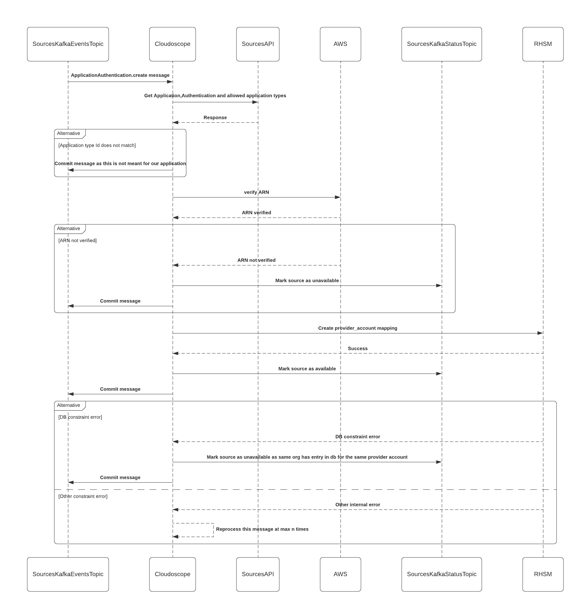

#   <i>CLOUDOREG</i>

Cloudoreg is a streamlined solution that simplifies the cloudigrade + auto-registration listener. 
With a focus on trust establishment for cloud access, Cloudoreg optimizes the functionality of cloudigrade while 
maintaining its current purpose of validating the source authentication.

With this implementation we will reduce the deployments and complexity present in our current code. In comparison to our current architecture where when a source is added, cloudigrade listens on sources event kafka topic for `ApplicationAuthentication.create` event and then verifies the source via celery workers(which have their separate deployed pods). It also maintains a separate db to store provider account id to org mapping. When the source is verified, a message is published to sources status topic to mark the source as available. When the source is marked as available a new `Application.update` message is published to events kafka topic to which then autoreg listener listens to and calls RHSM API to create new provider_account mapping.

Now with cloudigrade being handed over to Teamnado and being stripped off all other functionality, it makes sense to move this all into a single codebase where we will process a single `ApplicationAuthentication.create` message from sources event stream and in a single flow we will verify the source and create trust for it.

### Existing architecture

### Proposed architecture

### Sequence Diagram

### Running on local
Refer to `_deployment/RUN_LOCAL.md`

### How is this a improvement to existing architecture?
With current architecture we have 1 deployment for autoreg-listener, 1 deployment for cloudigrade sources message parser and 3 deployment for celery workers which do the job of processing data.Added to this cloudigrade itself had 1 db deployment as well. Now with the proposed architecture we would be requiring a single deployment in comparison to 5 deployments and 1 db which we had.

With current analysis of data flow into prod,we could see data a around 290 requests per week for cloudigrade event processing. This can be easily managed with a single deployment.

### Improvement points for future
1. We can add kafka transactions(after confirming kafka versions from sources team) for ensuring minimum loss of message.
2. With current architecture this design is not scalable, but we can design this to be scalable where we would separate message listener to single deployment and message processor to separate. We can not scale message listener deployments as we need to process message in the same sequence as it is produced. 
